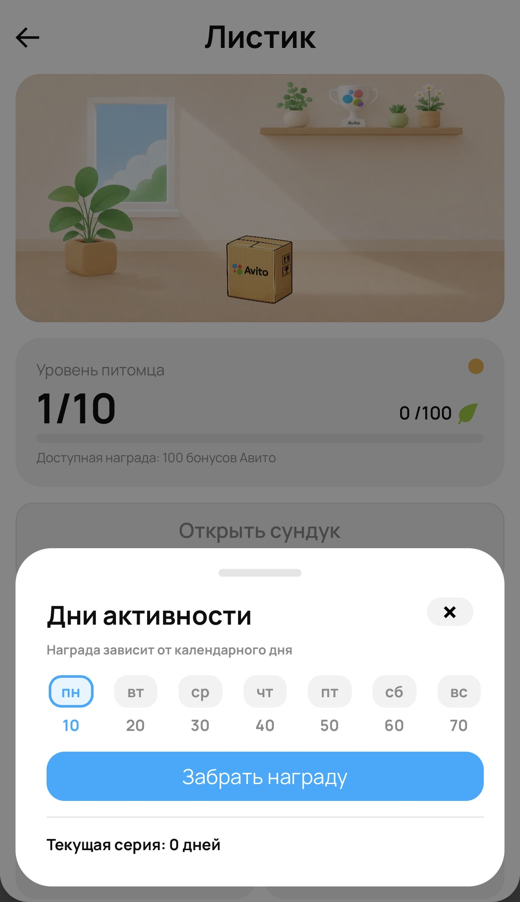
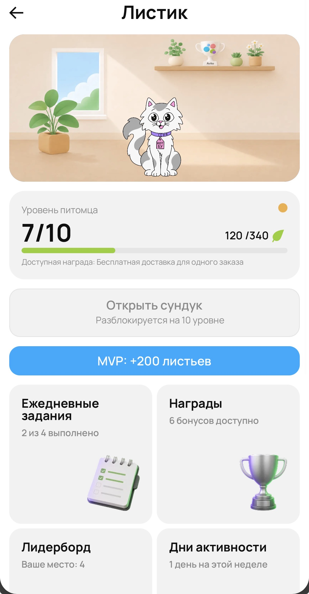
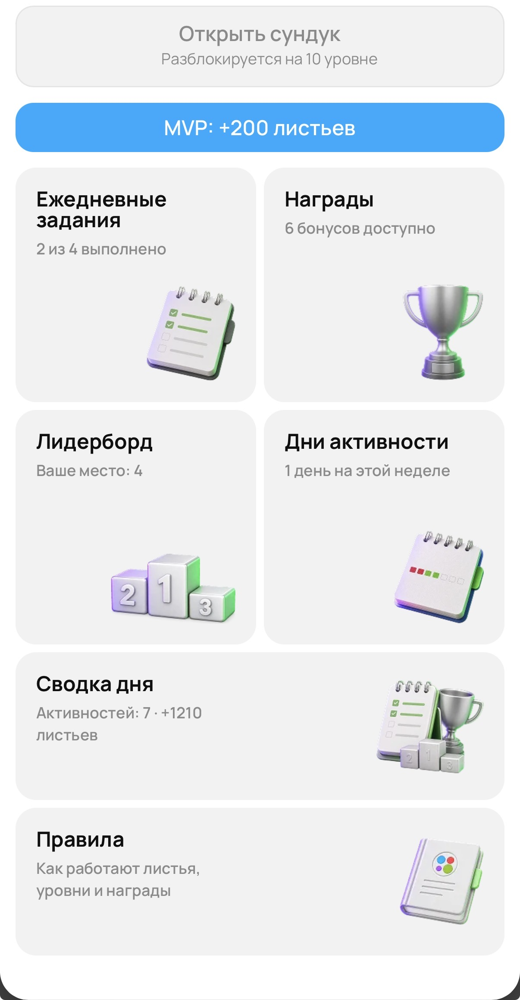
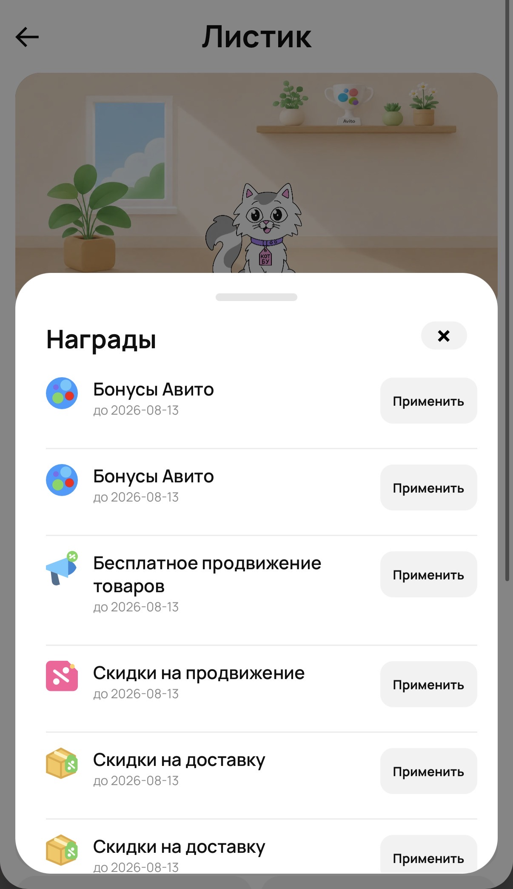
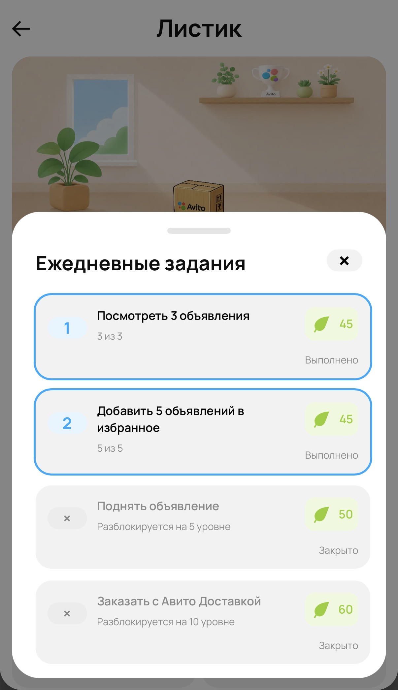
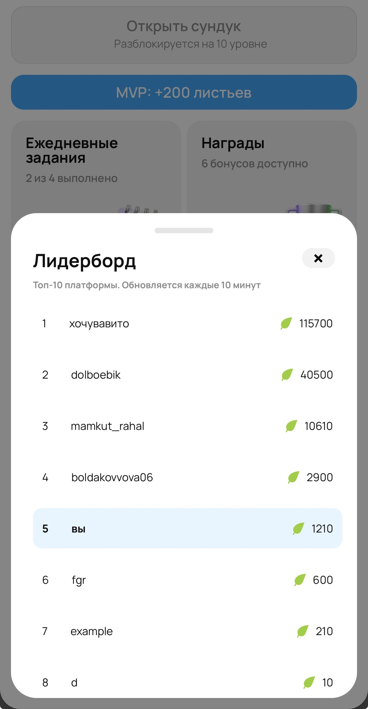
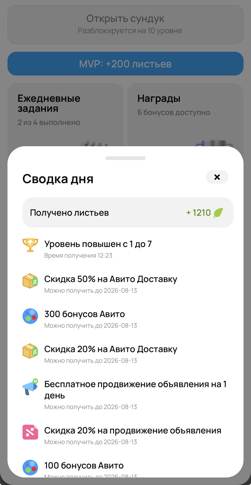
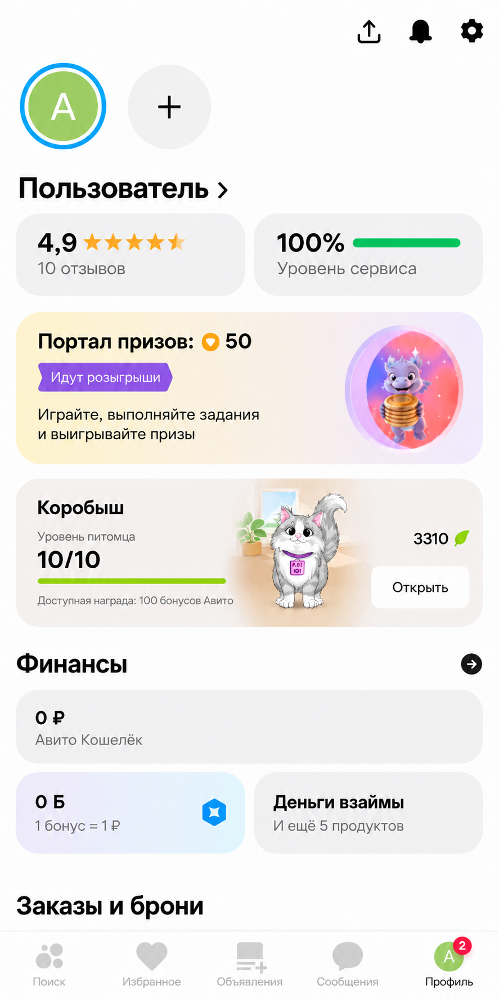

# Коробыш

Игровой слой поверх Авито: пользователь получает виртуального питомца, выполняет
ежедневные задания и получает листья за активность. Листья
повышают уровень питомца, открывают персональные награды и учитываются в
ежемесячном лидерборде.

Для тестирования механик проекта в рамках MVP  в интерфейсе
предусмотрена кнопка **«MVP: +200 листьев»**. Каждое нажатие начисляет питомцу
200 листьев и позволяет быстрее проверить повышение уровня и открытие сундука.
Также в MVP отключена отправка кодов подтверждения. Для авторизации необходимо указать почту и ввести любой код из 8 цифр.

### Сайт доступен по ссылкe:

**[Avito-korobysh](http://132.243.18.244:3000)**

### Описание решения:

**[Google Docs](https://docs.google.com/document/d/1UFAN0kMT8po3yejkDp6qLK1_UexiBgVp90pIeYflQxM/edit?usp=sharing)**

### Макет интерфейса:
**[Figma](https://www.figma.com/design/RHfbvMqMBv6jjdmBk84UbH/Avito-%D1%82%D0%B0%D0%BC%D0%B0%D0%B3%D0%BE%D1%87%D0%B8?node-id=386-450&t=B6gl5dSgMxxRX7nn-0)**

## Оглавление

- [Архитектура](#архитектура)
- [Технологии](#технологии)
- [Документация](#документация)
- [Внешний вид](#внешний-вид)
- [Быстрый запуск](#быстрый-запуск)
  - [Требования](#требования)
  - [Запуск всего проекта](#запуск-всего-проекта)
- [Разработка и тесты](#разработка-и-тесты)
- [Структура проекта](#структура-проекта)
- [Вклад участников](#вклад-участников)
- [Использование ИИ](#использование-ии)
- [Ограничения MVP](#ограничения-mvp)
- [Интеграция с Авито](#интеграция-с-авито)

## Архитектура

```text
frontend (React/Vite, :3000)
        |
        v
backend (Go API, :8090) -----> postgres (:5432)
        |
        +---- internal HTTP ----> puppeteer (:8091)
                                  задания, лидерборд, health-check
```


| Сервис | Назначение | Локальный адрес |
| --- | --- | --- |
| `postgres` | хранение пользователей, питомцев, листьев, заданий и наград | `postgres:5432` внутри сети Compose |
| `backend` | HTTP API, авторизация и игровые операции | `http://localhost:8090` |
| `puppeteer` | фоновые задания: назначение задач и расчёт лидерборда | `http://localhost:8091` |
| `frontend` | веб-интерфейс | `http://localhost:3000` |

## Технологии

- React 19, TypeScript, Vite и React Router;
- TanStack Query, WebSocket и SCSS Modules;
- Go 1.25 и стандартный `net/http` для backend и worker-сервиса;
- PostgreSQL 17, GORM и версионированные SQL-миграции;
- JWT-авторизация и YAML-конфигурация игровых механик;
- Docker Compose;
- ESLint, Stylelint, Prettier, golangci-lint и GitHub Actions.

## Документация

| Документ | Содержание |
| --- | --- |
| [Frontend](frontend/README.md) | локальный запуск, стек, структура, WebSocket и кеширование |
| [Backend](backend/README.md) | запуск API, конфигурация, структура, авторизация, WebSocket и тесты |
| [Puppeteer](puppeteer/README.md) | запуск worker-сервиса, фоновые задачи, внутренний API и тесты |
| [API](docs/api.md) | краткий справочник endpoint-ов и правила авторизации |
| [OpenAPI](docs/openapi.yaml) | полный машиночитаемый контракт API |
| [Продуктовая логика](docs/logic.md) | игровые механики и правила MVP |
| [Условие кейса](docs/кейс.pdf) | исходное задание хакатона в PDF |

После запуска проекта интерактивная документация API доступна в Swagger UI по
адресу <http://localhost:8090/swagger>.

## Внешний вид

|                               Авторизация                               |                                Еженедельный вход                                |
|:-----------------------------------------------------------------------:|:-------------------------------------------------------------------------------:|
|         |   |
|                              Главный экран                              |                                  Главный экран                                  |
|  |         |
|                                 Награды                                 |                               Ежедневные задания                                |
|          |                 |
|                                Лидерборд                                |                                   Сводка дня                                    |
|    |  |

## Быстрый запуск

### Требования

- Docker Engine с Docker Compose v2;
- свободные порты `3000`, `8090` и `8091`;
- для запуска тестов без Docker: Go 1.25+, Node.js 24+ и npm.

### Запуск всего проекта

Из корня репозитория:

```sh
cp .env.example .env
```

Для локальной разработки задайте необходимые переменные окружения. Сгенерируйте два
секрета длиной не менее 32 символов:

```sh
openssl rand -hex 32
```

Вставьте разные значения в `.env`:

```dotenv
JWT_SECRET=<значение_1>
INTERNAL_SERVICE_TOKEN=<значение_2>
```

Запустите сервисы:

```sh
make up
```

Эта команда применяет непримененные версионированные миграции, собирает
Docker-образы и запускает PostgreSQL, backend, puppeteer и frontend.

Миграции находятся в `migrations/` и применяются отдельным контейнером
`migrator`. Для ручного применения миграций используйте:

```sh
make migrate
```

Остановить проект:

```sh
make down
```

Дополнительные команды:

```sh
make ps       # состояние сервисов
make logs     # логи всех сервисов
make restart  # перезапуск без пересборки
make build    # пересборка образов
```

## Разработка и тесты

### Backend

```sh
cd backend
go test ./...
go test -race ./...
```

### Puppeteer

```sh
cd puppeteer
go test ./...
```

### Frontend

```sh
cd frontend
npm ci
npm run build
npm run lint
npm run lint:styles
```

### Все проверки

```sh
make lint
```

`make lint` запускает frontend-проверки и golangci-lint для backend в Docker.

При таком режиме backend должен быть доступен на `http://localhost:8090`.

## Структура проекта

```text
backend/
  main.go                  # сборка зависимостей и HTTP-сервер
  internal/
    auth/                  # OTP, JWT и аутентификация
    chest/                 # открытие сундуков и выдача наград
    config/                # загрузка и валидация конфигурации
    daily_report/          # ежедневные сводки активности
    database/              # PostgreSQL, GORM и миграции
    email/                 # отправка email-уведомлений
    events/                # доверенные события активности
    handlers/              # HTTP handlers и маршруты
    models/                # модели данных и сущности GORM
    pet/                   # питомец, листья, награды уровней
    reward_catalog/        # загрузка каталога наград из YAML
    rewards/               # персональные награды и их использование
    tasks/                 # чтение и выдача дневных заданий
    testutil/              # тестовые заглушки и вспомогательный код
    weekly_login/          # недельные награды за вход
puppeteer/
  main.go                  # фоновые jobs и health endpoint
config/
  task_definitions.yaml    # варианты заданий
  leaderboard_rewards.yaml # награды топ-3
  level_rewards.yaml       # награды за уровни питомца
frontend/                  # React/Vite интерфейс
docs/
  api.md                   # краткий справочник endpoint-ов
  assets/                  # скриншоты интерфейса и интеграции
  openapi.yaml             # контракт API
  logic.md                 # продуктовая логика MVP
migrations/                # версионированные миграции PostgreSQL
compose.yaml               # локальный production-like запуск
```

## Вклад участников

### Совместная работа

- Сформировали продуктовую концепцию, определили ценность продукта, целевую аудиторию и ключевые пользовательские сценарии.
- Определили состав MVP и приоритеты разработки первой версии.
- Совместно проработали UX/UI и основные пользовательские сценарии.
- Согласовали архитектуру взаимодействия frontend и backend, API и модели данных.

### Ломаев Игорь — Frontend

- Настроил базовую архитектуру frontend-приложения и структуру основных страниц.
- Создал общие UI-компоненты, стили, типографику и нижние панели приложения.
- Разработал экран питомца и интерфейсы заданий, активности, наград, уровней, правил и лидерборда.
- Подключил авторизацию, REST API и обновление профиля и ежедневной сводки через WebSocket.
- Настроил кеширование, синхронизацию и ревалидацию серверных данных с помощью TanStack Query.
- Реализовал получение наград, открытие сундуков и актуализацию связанных данных после действий пользователя.
- Добавил состояния загрузки и ошибок, уведомления, адаптивную вёрстку и корректное отображение текстов.

### Болдаков Владимир — Backend

- Проработал продуктовую логику, игровую экономику и основные игровые механики приложения.
- Спроектировал API и реализовал backend-логику ежедневных заданий.
- Реализовал механику питомца, повышение уровня, начисление игровой валюты и выдачу наград.
- Разработал механику покупки и открытия сундуков, транзакционную обработку операций и конфигурацию наград через YAML.
- Реализовал систему прогресса заданий, обработку их выполнения и начисление наград.
- Добавил unit- и e2e-тесты, проводил рефакторинг и устранял ошибки в реализации API и сборке проекта.

### Грицун Артем — Backend

- Спроектировал техническую архитектуру проекта на базе модульного Go-backend, PostgreSQL и отдельного worker-сервиса для фоновых задач.
- Настроил Docker-инфраструктуру проекта и единый запуск frontend, backend, worker-сервиса и PostgreSQL через Docker Compose.
- Реализовал базовые backend-механизмы: JWT-авторизацию, инфраструктуру заданий и наград, лидерборд и транзакционный учёт игровой валюты.
- Подготовил OpenAPI-спецификацию и подключил Swagger UI для документации и тестирования API.
- Разработал систему версионируемых миграций PostgreSQL и настроил ограничения целостности данных.
- Реализовал обработку ошибок и корректное завершение сервисов.
- Настроил CI-проверки, автоматический запуск тестов и линтеров для контроля качества проекта.

### Лафуткин Андрей — Backend

- Реализовал механику еженедельной активности и выдачи награды за регулярные входы пользователя.
- Спроектировал API и разработал сервис еженедельной активности, включая расчёт серии входов и корректную обработку дат.
- Разработал сервис ежедневной сводки для формирования ежедневной сводки активности пользователя.
- Реализовал механизм уведомления о готовности новой ежедневной сводки.
- Добавил unit- и e2e-тесты, проводил рефакторинг и устранял ошибки в реализации API и сборке проекта.

## Использование ИИ

В ходе работы над проектом использовался искусственный интеллект для решения следующих задач:

- **Развитие продуктовой концепции** - помощь в формулировании идеи проекта, анализе конкурентных решений, 
проработке механик, пользовательских сценариев и возможных направлений развития продукта.
- **Поддержка дизайна** - генерация отдельных графических элементов и иконок, поиск визуальных референсов и
проработка интерфейсных решений.
- **Поддержка разработки и тестирования** - генерация тестов по подготовленным техническим сценариям 
для проверки основных пользовательских сценариев и корректности работы функционала.

## Ограничения MVP

### 1. Email-уведомления

Пользователь получает письма о важных событиях.
Планируется добавить несколько типов уведомлений:
- напоминание о ежедневном входе для получения награды;
- напоминание о начатом задании;
- предупреждение о скором истечении срока действия награды;
- ежедневная сводка активности.

**Примеры**
- **Ежедневная награда:** «Вы ещё не забрали ежедневную награду. Загляните к Коробышу сегодня и получите 50 листиков».
- **Задание:** «Не забудьте выполнить ежедневное задание: вам осталось посмотреть 3 объявления в категории „Одежда и обувь“».
- **Истечение награды:** «Ваш промокод на скидку 100 рублей в категории „Одежда и обувь“ сгорит через 24 часа. Успейте использовать его».

### 2. Уведомления внутри приложения

В приложении отображаются те же уведомления, что приходят по электронной почте.
Уведомления могут отображаться в отдельном центре уведомлений или в виде всплывающих сообщений внутри интерфейса.

### 3. Персональные задания на основе ИИ

Система получает данные об активности пользователя через внешний API, анализирует их и формирует индивидуальные задания.
На задания могут влиять предыдущие покупки, публикации и просмотр объявлений, а также добавление товаров в избранные.

**Пример:** пользователь часто покупает товары для дома -
система предлагает задание: «Совершите покупку в категории “Дом” и получите 100 листиков».

### 4. Кастомизация комнаты

Пользователь может изменять комнату питомца и приобретать за листики мебель, декор и тематические предметы. 
Купленные элементы сохраняются в коллекции и могут быть размещены в комнате.

**Пример:** за 300 листиков пользователь покупает настольную лампу и добавляет ее в комнату питомца.

### 5. Персональные предложения

Питомец может предлагать товары, скидки и промокоды в игровой форме, основываясь на интересах и активности пользователя.

**Пример:** «Коробышу холодно без куртки - воспользуйтесь промокодом на одежду и обувь и согрейте своего питомца».

### 6. Сезонные события
В приложении могут появляться временные тематические события, приуроченные к праздникам или сезонам, 
например Новый год или «Скоро в школу». На время события появляется отдельная тематическая вкладка, 
а комната и питомец получают соответствующее оформление.

**Пример:** во время новогоднего события в комнате появляется ёлка и праздничный декор. 
В отдельной вкладке пользователь получает тематические задания, например, посмотреть несколько объявлений с новогодними 
товарами, а в качестве награды может получить скидку или промокод на гирлянды, ёлки и другие праздничные товары.

## Интеграция с Авито

Коробыш спроектирован как игровой раздел внутри экосистемы Авито. Чтобы переход
между сервисами воспринимался естественно, интерфейс проектировался в соответствии с визуальным стилем Авито.

- страница 404 выполнена в стилистике оригинальной страницы 404 Авито;
- кнопка «Назад» на главном экране предусмотрена для возврата в профиль Авито и
  повторяет навигацию из встроенных разделов сервиса;
- кнопка «Применить» у полученных промокодов переводит пользователя на сайт
  Авито, где он может продолжить целевой сценарий и воспользоваться наградой.

<p align="center">
  
</p>
